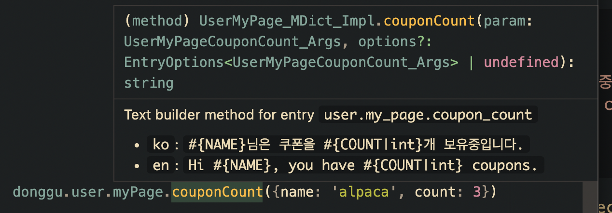

# Donggu


동구는 다국어 데이터 관리를 위한 가볍지만 강력한 CLI입니다.
데이터 관리부터 번역가와의 텍스트 들여오기/내보내기, 소스코드와의 간편한 연동 등 프로덕션 환경에서 요구하는 모든 상황을 대응할 수 있습니다.

## 주요 기능
### 템플릿 포맷팅

다양한 표시 형태를 지원하는 템플릿 포맷팅을 사용할 수 있습니다. 강력한 템플릿 기능을 통해 포맷팅에 필요한 코드 양을 줄일 수 있을 뿐만 아니라 번역가와 디자이너에게 텍스트의 맥락을 설명하기 쉬워집니다.

|템플릿|출력 예시|
|-|-|
|`이동거리 #{DISTANCE\|float\|6.3}km`|이동거리&nbsp;&nbsp;&nbsp;1.75km|
|`포인트 #{BALANCE\|int\|8,}원`|포인트&nbsp;&nbsp;123,456원|
|`주행 이력 #{HAS_HISTORY\|bool\|있음,없음}`|주행 이력 없음|


### 소스 코드와 쉽게 연동 가능한 라이브러리 코드 생성 
Typescript, Typescript React, Go 프로젝트에서 손쉽게 사용 가능한 라이브러리 코드를 생성할 수 있습니다. 동적으로 텍스트를 불러올 필요가 없고, 빠르면서도 타입 안정성이 보장되는 라이브러리를 명령 한줄로 생성할 수 있습니다.

```json
{
    "user.my_page.coupon_count": {
       "ko": "#{NAME}님은 쿠폰을 #{COUNT|int}개 보유중입니다.",
       "en": "Hi #{NAME}, you have #{COUNT|int} coupons."
    }
}
```
이렇게 텍스트를 저장하고 `donggu export typescript my-project`를 실행하면 아래처럼 간편한 라이브러리가 생성됩니다. 


### 다양한 형태로 데이터 내보내고 들어오기
동구는 JSON 형태로 번역 데이터를 관리하지만, 언제든지 CSV 혹은 HTML(준비중) 형태로 데이터를 내보내고 들여올 수 있습니다. 번역가와 디자이너에게 필요한 텍스트를 손쉽게 전달할 수 있고, 수정된 데이터도 명령 한번으로 프로젝트에 들어올 수 있습니다.
```bash
donggu export csv task.csv // 현재 프로젝트를 CSV로 내보내기
donggu merge csv done.csv  // 작업된 CSV를 현재 프로젝트에 합침
```
여기에서 어떤 데이터가 바뀌었는지의 diff 분석도 쉽게 가능합니다.

# 시작하기
[Releases](https://github.com/maasasia/donggu/releases/) 페이지에서 바이너리를 다운로드 하거나, 설치 스크립트를 이용해 다운로드 할 수 있습니다.
```bash
wget -O install.sh https://raw.githubusercontent.com/maasasia/donggu/main/install.sh && chmod +x install.sh && ./install.sh
```
바이너리가 위치한 폴더를 `PATH`에 추가해주세요.

데이터를 관리할 폴더로 이동해 새로운 프로젝트를 생성합니다.
```bash
mkdir my-project && cd my-project
donggu init
```
필요한 정보를 입력하고 나면 `metadata.json`과 `content.json`이 생성됩니다.
`metadata.json`은 메타데이터 파일로, 지원할 언어의 목록과 버전 정보등을 담습니다.
`content.json`은 번역 데이터를 담는 파일입니다.

아래에서 보다 자세한 사용 방법을 알아보세요.

# 사용방법
아래와 같은 동구의 주요 기능을 설명합니다.
- [프로젝트 구성](#usage-project)
- [템플릿 포맷팅](#usage-templates)
- [라이브러리 코드 생성](#usage-codegen)
- [데이터 내보내기와 들어오기](#usage-io)
- [CLI](#usage-cli)

## 프로젝트 구성 <span id="usage-project"></span>
동구의 프로젝트는 메타데이터 파일 (`metadata.json`), 데이터 파일 (`content.json`)으로 구성됩니다.

### 데이터 파일
데이터 파일은 여러개의 **텍스트 항목**으로 이루어져 있습니다. 각 텍스트 항목은 고유한 키와 언어별로 대응되는 텍스트로 이루어져 있습니다.

각 키는 `.`으로 분리된 여러 개의 `snake_case` 항목으로 이루어져 있습니다. `camelCase`나 `PascalCase`를 사용해서는 안되고, 영어 소문자, 숫자, `_`를 제외하고는 사용할 수 없습니다.

- (X) `common.appTitle`
- (X) `common.1page.title` (숫자로 시작하면 안됨)
- (O) `common.page_1.title`

간단한 데이터 파일을 만든다면 아래와 같습니다.
```json
{
    "user.my_page.welcome": {
        "ko": "알파카 가입을 환영합니다!",
        "en": "Welcome to Alpaca!",
        "context": "처음 가입했을 때만 표출되는 텍스트"
    },
    "user.my_page.coupon_count": {
        "ko": "#{NAME}님은 쿠폰을 #{COUNT|int}개 보유중입니다.",
        "en": "Hi #{NAME}, you have #{COUNT|int} coupons."
    }
}
```
언어는 메타데이터 파일에 설정된 값들만 사용할 수 있고, 필수 언어로 지정된 언어들은 반드시 포함해야 합니다.

`user.my_page.welcome`를 보면 `context`라는 키가 있습니다.
이 키는 번역 텍스트가 아니고 텍스트 항목이 어떤 맥락에서 나오는 텍스트인지 설명하는 주석 역할을 합니다.
여기에 어떤 화면에서 사용되는 항목인지, 어떤 상황에서만 나오는 값인지 등을 설명해서 디자이너나 번역가가 맥락을 잘못
이해할 위험을 줄일 수 있습니다. `context`는 필수가 아니며, 생성되는 라이브러리 코드에 포함되지 않습니다.


### 메타데이터 파일

메타데이터 파일은 아래와 같은 필드로 이루어져 있습니다.

- `supported_languages`: 프로젝트에서 지원하는 언어를 모두 입력합니다. `context`를 제외하고는 어떤 값이든 사용할 수 있습니다. 필요에 따라 자유롭게 사용하면 되나, [2글자의 ISO 639-1 코드](https://en.wikipedia.org/wiki/List_of_ISO_639-1_codes)를 권장합니다.
- `required_languages`: 모든 텍스트 항목이 지원해야 하는 언어들입니다. 여기에 있는 언어들은 모두 `supported_languages`에 포함되어 있어야 합니다.
- `version`: 프로젝트의 버전입니다. 라이브러리 코드를 생성할 때 이 값을 이용합니다.
- `exporter_options` (선택): 내보내기 형식별로 필요한 설정입니다. 내보내기 형식별로 필요한 설정은 다르며, [코드 생성](#)과 [내보내기와 들여오기](#)에 정리되어 있습니다.

```json
{
  "exporter_options": {
    "typescript": {
      "packageName": "@maasasia/translation-alpaca"
    }
  },
  "required_languages": ["ko", "en"],
  "supported_languages": ["ko", "en", "ja"],
  "version": "0.1.3"
}
```
위의 예시를 설명하면, 이 프로젝트는
- 한국어, 영어, 일본어에 대한 번역을 담고 있으며
- 한국어, 영어는 모든 텍스트가 번역되어 있지만 일본어는 일부만 지원하고
- 버전은 0.1.3입니다.
- Typescript 패키지를 만들 때는 패키지명으로 `@maasasia/translation-alpaca`를 사용합니다.

### CLI로 프로젝트 생성
위와 같은 프로젝트 구성은 동구를 이용해 자동으로 생성할 수 있습니다. 프로젝트를 만들고 싶은 폴더로 이동해
```
donggu init
```
후 필요한 필드를 채워주세요.

## 템플릿 포맷팅 <span id="usage-templates"></span>

## 라이브러리 코드 생성 <span id="usage-codegen"></span>
동구의 `export` 명령으로 프로젝트의 다국어 데이터를 소스코드에서 사용하기 위해 라이브러리 코드를 생성할 수 있습니다.
```bash
donggu export typescript my-project
```
[i18next](https://www.i18next.com/)이나 [i18n-node](https://github.com/mashpie/i18n-node) 등 JSON을 동적으로 불러오는 라이브러리들과 달리,
동구는 프로젝트의 데이터에 맞춰진 코드를 미리 생성합니다. 그렇기 때문에 키가 누락되거나 템플릿의 형태가 잘못되는 오류를 타입 검사로 사전에 방지할 수 있습니다.
또 런타임에 JSON을 분석하지 않고 미리 데이터를 생성하므로 보다 뛰어난 성능을 기대할 수 있습니다.

### Typescript
Typescript에서 다국어 데이터를 사용하기 위한 라이브러리를 생성합니다.
```bash
donggu export typescript my-project
```
자세한 사용 방법은 [Typescript Exporter](docs/exporter-ts.md)를 읽어주세요.

#### 사용 예제
```ts
import { Donggu } from "@my-org/translations";  // 동구가 생성한 라이브러리

// 현재 사용자의 언어를 판단하는 함수. HTTP 요청의 Accept-Language 파싱 등을 여기서 수행하면 됩니다.
// 배열의 순서대로 우선순위를 가집니다.
const languageResolver = () => {
  return [getUserLanguage(), 'ko'];
};
const donggu = new Donggu(languageResolver);
console.log(donggu.example.hello({name: "동구"})); // 동구님 안녕하세요!
```


### Typescript React
Typescript React에서 다국어 데이터를 사용하기 위한 라이브러리를 생성합니다.
Typescript 라이브러리와 유사하지만, 줄바꿈 설정 등 React와의 연동을 돕는 기능이 포함되어 있습니다.
```bash
donggu export ts-react my-project
```
자세한 사용 방법은 [Typescript React Exporter](docs/exporter-ts-react.md)를 읽어주세요.

#### 사용 예제
```ts
import { Donggu } from "@my-org/translations";  // 동구가 생성한 라이브러리

// 현재 사용자의 언어를 판단하는 함수. HTTP 요청의 Accept-Language 파싱 등을 여기서 수행하면 됩니다.
// 배열의 순서대로 우선순위를 가집니다.
const languageResolver = () => {
  return [getUserLanguage(), 'ko'];
};
const donggu = new Donggu(languageResolver);

const MyElement = (name: string) => {
  return (
    <>
      {donggu.example.hello({name})}
    </>
  );
};

// 동구님 안녕하세요!
ReactDOM.render(<MyElement name="동구">, document.getElementById("root"))
```

### Go
Go에서 다국어 데이터를 사용하기 위한 라이브러리를 생성합니다.
```bash
donggu export go my-project
```
자세한 사용 방법은 [Go Exporter](docs/exporter-go.md)를 읽어주세요.

#### 사용 예제
```golang
package main

import (
  "fmt"
  "github.com/my-org/translations" 
)

// langResolver는 현재 사용자의 언어를 판단하는 함수입니다.
// query 함수는 현재 표시하고자 하는 텍스트 항목에 원하는 언어가 있는지 반환하는 함수입니다.
// 이 함수는 항상 query 결과가 true이거나 requiredLang에 포함되어 있는 값을 반환해야 합니다.
func langResolver(query func(lang string) bool) string {
    if query("en") {
        return "en"
    }
    return "ko"
}

func main() {
    donggu := translations.NewDonggu(langResolver)
    // 동구님 안녕하세요!
    fmt.Println(donggu.Example().Hello("동구"))
}
```

### 기존 프로젝트와의 연동
생성된 라이브러리는 프로젝트에 직접 추가하거나, 언어별로 지원하는 패키지 시스템을 통해 이용할 수 있습니다.
모노레포를 구성하거나 private package registry를 사용하는 등 다양한 시나리오에 대한 설명은
[기존 프로젝트와의 연동](docs/integration.md)를 참고하세요.

## 데이터 내보내기와 들여오기 <span id="usage-io"></span>
### 데이터 내보내기
앞서 설명한 것과 같이 다국어 데이터의 원본은 프로젝트 단위로 관리되지만, 외부에 공유하기 위해 프로젝트 데이터를
여러 파일 형태로 내보낼 수 있습니다.
```
donggu export [내보낼 파일 형태] [내보낼 파일명]
```

### 데이터 들여오기 (합치기)
`donggu merge` 명령으로 여러 데이터 파일을 하나로 합칠 수 있습니다.
```
donggu merge [외부 데이터 형태] [외부 데이터 파일명]
```
외부 데이터 형태는 `json`, `csv`를 지원합니다.

아래와 같이 프로젝트가 위치한 폴더에서 `donggu merge`를 실행하면 외부 데이터(`exported.csv`)의 내용물을 프로젝트 데이터(`content.json`)과
합친 후, 결과물을 `content.json`에 저장합니다.
```sh
$ ls
content.json metadata.json exported.csv
$ donggu merge csv exported.csv
✅ Done in 0.015s
```
외부 데이터는 프로젝트 데이터를 항상 덮어씌우지만, 두 데이터가 일부만 겹칠 경우에는 최대한
원본 데이터를 유지하기 위해 노력합니다.

다음과 같은 `content.json`을 가지는 프로젝트가 있고, 여기에 `import.json`을 합치는 경우를 생각해봅시다.
#### 프로젝트 데이터 (`content.json`)
```json
{
  "page1": {
    "ko": "1페이지",
    "en": "Page 1"
  },
  "hello": {
    "ko": "안녕",
    "ja": "こんにちは"  
  }
}
```
#### 외부 데이터 (`import.json`)
```json
{
  "hello": {
    "ko": "안녕하세요",
    "en": "Hello"
  },
  "page2": {
    "ko": "2페이지",
    "en": "Page 2"
  }
}
```
두 파일을 합친 결과는 다음과 같습니다.
```json
{
  "page1": {
    "ko": "1페이지",
    "en": "Page 1"
  },
  "page2": {
    "ko": "2페이지",
    "en": "Page 2"
  },
  "hello": {
    "ko": "안녕하세요",
    "en": "Hello",
    "ja": "こんにちは"
  },
}
```

- `page1`은 프로젝트 데이터에는 있지만 외부 데이터에는 없어 그대로 유지됩니다.
- `page2`는 외부 데이터에만 있어 새로 추가되었습니다.
- `hello`는 두 데이터에 모두 있는데, 프로젝트 데이터에만 있는 `ja` 텍스트는 그대로 유지되었지만 외부 데이터에도 있는 `en`, `ko`는 추가되거나 덮어씌워졌습니다.


## CLI <span id="usage-cli"></span>
```
Donggu is a simple cli for managing i18n text data

Usage:
  donggu [command]

Available Commands:
  completion  Generate the autocompletion script for the specified shell
  diff        Show differences of a content file against the current project
  export      Export something
  fmt         Format content and metadata file
  help        Help about any command
  init        Initialize new project
  merge       Merge a content file to the current project

Flags:
  -h, --help             help for donggu
  -P, --project string   Project folder (default: current directory)

Use "donggu [command] --help" for more information about a command.
```


# License
MIT